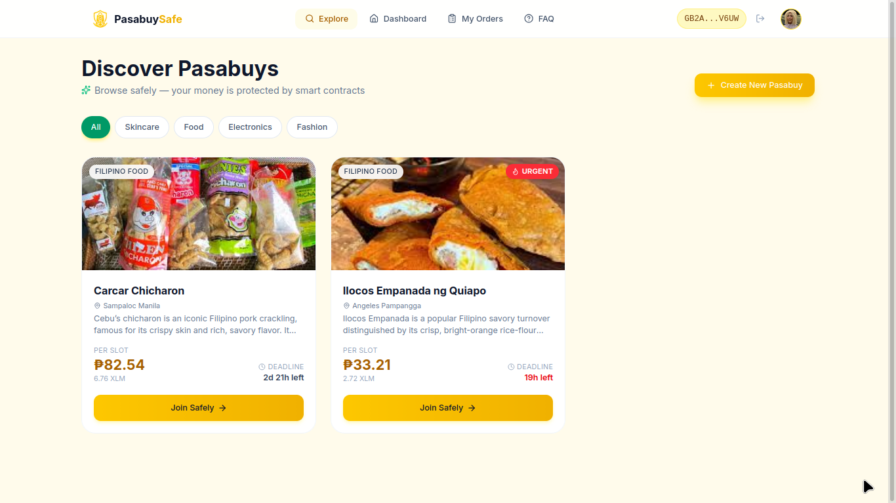
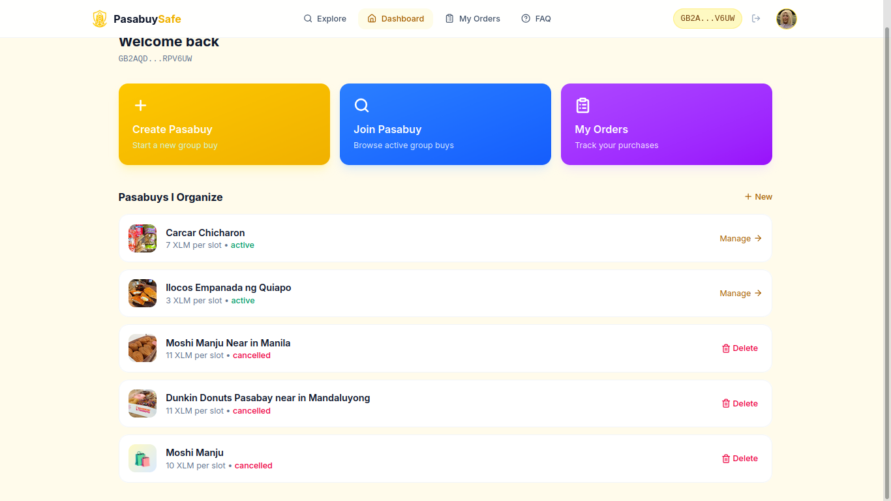

# 🛡️ PasabuySafe

<p align="center">
  
</p>

**Safe group buying for Filipino communities — powered by blockchain escrow.**

[](https://github.com/Vallywi/PasabuySafe/actions/workflows/ci.yml)
[](https://github.com/Vallywi/PasabuySafe/actions/workflows/ci.yml)
[](https://github.com/Vallywi/PasabuySafe/actions/workflows/ci.yml)
[](https://pasabuysafe.vercel.app)
[](https://stellar.org/soroban)
[](https://nextjs.org/)
[](https://www.typescriptlang.org/)
[](https://supabase.com/)
[](https://www.rust-lang.org/)
[](https://opensource.org/licenses/MIT)
[](#)

PasabuySafe is an anti-scam platform that protects buyers in pasabuy (group buy) transactions. Instead of sending money directly to an organizer and hoping for the best, your payment is locked in a smart contract that only releases funds when you confirm you received your order.

---

## 🚨 The Problem

In Filipino online communities — Facebook groups, Viber GCs, Telegram channels — **pasabuy scams** are everywhere. The pattern is always the same:

1. A "trusted" organizer posts a group buy deal (Korean skincare, gadgets, food from Japan)
2. Buyers send money via **GCash, Maya, or bank transfer** — directly to the organizer's personal account
3. Once the money is collected, the organizer **blocks everyone** and disappears
4. Victims file police reports that go nowhere. The money is gone.

Thousands of Filipinos lose money every month to this scheme. Amounts range from ₱500 to ₱50,000+ per victim. Reputation systems don't work because scammers build trust over months, then do one massive scam run. GCash and bank transfers offer zero buyer protection. COD doesn't apply to group buys. Reporting to Facebook or Viber gets the account banned — but never returns the money.

---

## 💡 How PasabuySafe Solves It

The core principle is simple: **the organizer never touches the money until the buyer confirms delivery.**

Your payment goes into an escrow smart contract on the Stellar blockchain — not into anyone's personal wallet. The money sits there, locked by code, until you say "I got my order."

### Traditional vs PasabuySafe

```
❌ Traditional (scam-prone):
   Buyer → sends money → Organizer → blocks buyer → SCAMMED

✅ PasabuySafe:
   Buyer → pays into ESCROW CONTRACT → money locked on blockchain
   Organizer marks "shipped" → Buyer receives item → Buyer clicks "Confirm"
   ONLY THEN → money released to organizer

   If scammed? → deadline passes → buyer clicks "Refund" → money returns automatically
```

No one — not even the PasabuySafe team — can override the smart contract. The organizer can't withdraw. The money only moves when **you** say it moves.

---

## ⚙️ How It Works

### 👤 For Organizers

1. **Create a pasabuy** — Set a title, price per slot, deadline, and description. Upload a cover image. The escrow contract is initialized on-chain.
2. **Share the link** — Buyers join from the Explore page or your share link.
3. **Fulfill orders** — Purchase the items, then mark each buyer's order as "Delivered."
4. **Get paid** — Once a buyer confirms receipt, the escrowed funds are released to your wallet.

### 🛒 For Buyers

1. **Browse** — Explore active pasabuys. See prices, slots remaining, deadlines, and organizer info.
2. **Join & pay** — Enter your delivery details, then deposit your payment into the escrow contract via Freighter wallet.
3. **Receive your item** — The organizer delivers your order.
4. **Confirm** — Click "Confirm Delivery" to release funds to the organizer. Done.

**Or, if something goes wrong:**

5. **Deadline passes without delivery?** → Click "Claim Refund" → your money returns to your wallet instantly. No approvals needed.

---

## ✨ Key Features

- 🌐 **Anyone can create a pasabuy** — No approval process, no gatekeepers
- 🔒 **On-chain escrow** — Payments locked in a Soroban smart contract (XLM on Stellar)
- 📱 **Philippine phone number + delivery details** — Collected per order so organizers can fulfill
- 🔗 **Transaction history with Stellar Expert links** — Full transparency, every transaction viewable on-chain
- ⏳ **7-day confirmation window** — Buyers have time to verify their order before funds release
- 💸 **Automatic refund after deadline** — If the organizer doesn't deliver, buyers reclaim their funds
- 🛑 **Organizer can cancel pasabuy** — Graceful cancellation with refund flow for deposited buyers
- ↩️ **Buyer can cancel order** — Change your mind? Cancel and claim your refund after the deadline
- 📲 **Mobile-responsive UI** — Built for the way Filipinos browse: on their phones

---

## 🛡️ Anti-Scam Protection

Every common scam attempt is blocked by the contract design:

| Scam Attempt | How PasabuySafe Blocks It |
|-------------|--------------------------|
| Organizer collects money and blocks buyers | Money is in the contract, not the organizer's wallet. Buyer refunds after deadline. |
| Organizer marks "delivered" without shipping | `mark_delivered` alone does NOT release funds. Buyer must also confirm. |
| Organizer fakes buyer's confirmation | Impossible — confirmation requires the buyer's private key signature. |
| Organizer tries to withdraw directly | No withdraw function exists. Only buyer-signed confirmation moves money to organizer. |
| Organizer changes the deadline | Impossible — deadline is set once at initialization, stored immutably on-chain. |
| Organizer deploys a modified contract | Each contract has a unique verifiable address. Buyers check the address before joining. |

---

## 🧰 Tech Stack

| Layer | Technology |
|-------|-----------|
| 📜 Smart Contract | Rust + Soroban SDK (Stellar blockchain) |
| 🎨 Frontend | Next.js 14, TypeScript, Tailwind CSS, shadcn/ui |
| 🗄️ Database | Supabase (PostgreSQL + Realtime + Edge Functions) |
| 👛 Wallet | Freighter (Stellar browser wallet) |
| ☁️ Hosting | Vercel |
| 🎞️ Animations | Framer Motion |

---

## 🚀 Quick Start

### 📋 Prerequisites

- [Stellar CLI](https://developers.stellar.org/docs/tools/developer-tools) installed
- [Node.js](https://nodejs.org/) 18+
- [Freighter Wallet](https://www.freighter.app/) browser extension

### 🦀 Run the Smart Contract Tests

```bash
cargo test
```

### 💻 Run the Web App

```bash
cd pasabuy-safe-web
npm install
npm run dev
```

### 🔑 Environment Variables

Create `pasabuy-safe-web/.env.local`:

```env
NEXT_PUBLIC_CONTRACT_ID=<your-deployed-contract-id>
NEXT_PUBLIC_NETWORK_PASSPHRASE=Test SDF Network ; September 2015
NEXT_PUBLIC_RPC_URL=https://soroban-testnet.stellar.org:443
NEXT_PUBLIC_HORIZON_URL=https://horizon-testnet.stellar.org
NEXT_PUBLIC_SUPABASE_URL=<your-supabase-url>
NEXT_PUBLIC_SUPABASE_ANON_KEY=<your-supabase-anon-key>
NEXT_PUBLIC_APP_URL=http://localhost:3000
NEXT_PUBLIC_STELLAR_EXPERT_URL=https://stellar.expert/explorer/testnet
```

---

## 📜 Smart Contract

The PasabuySafe escrow contract is written in Rust and deployed on Stellar's Soroban platform. It uses a **multi-organizer architecture** — each pasabuy initializes its own escrow instance with an organizer address, token, and deadline.

### 🧩 Contract Functions

| Function | Who Calls It | What It Does |
|----------|-------------|-------------|
| 🆕 `create_pasabuy` | Organizer | Initializes a new escrow with token address and deadline |
| 💰 `deposit` | Buyer | Locks buyer's payment in the contract |
| 📦 `mark_delivered` | Organizer | Signals that the buyer's order has been shipped/delivered |
| ✅ `confirm_delivery` | Buyer | Buyer confirms receipt — funds released to organizer |
| ↩️ `refund` | Buyer | Returns funds to buyer (only after deadline passes) |
| ⏰ `release_expired` | Anyone | Releases funds from expired confirmed orders |

### 🔁 How PasabuySafe works

Each pasabuy — and each buyer's order within it — moves through a bounded state machine enforced by the Soroban contract. Money only leaves the contract on the transitions that end in green.

```
                  create_pasabuy
                        │
                        ▼
                  ┌───────────┐   organizer cancels       ┌────────────┐
                  │  Active   │ ────────────────────────▶ │ Cancelled  │  (deposits refunded)
                  └───────────┘                           └────────────┘
                        │
                buyer deposit
                        │
                        ▼
                  ┌───────────┐   buyer cancels           ┌────────────┐
                  │ Deposited │ ────────────────────────▶ │ Cancelled  │  (refund after deadline)
                  └───────────┘                           └────────────┘
                        │
              organizer marks delivered
                        │
                        ▼
                  ┌───────────┐   deadline passes,        ┌────────────┐
                  │ Delivered │   buyer never confirms    │  Refunded  │  (funds → buyer)
                  └───────────┘                           └────────────┘
                        │
             buyer confirms delivery
                        │
                        ▼
                  ┌───────────┐
                  │ Confirmed │  (funds released → organizer)
                  └───────────┘
```

**The protection model, honestly stated:** naive "lock all the money and trust the organizer" escrow is not safer than direct payment, because once capital reaches the organizer it cannot be clawed back. PasabuySafe's protection comes from three rules the contract enforces without exception:

- **The organizer never holds the money.** Deposits go to the contract, never to a personal wallet.
- **Only the buyer's signature releases funds.** `confirm_delivery` requires the buyer's private key. The organizer cannot forge it.
- **Deadlines are immutable.** If the deadline passes without delivery, the buyer's refund is a one-transaction call, unstoppable by the organizer or the platform.

---

## 🌐 Deployed contract

- **PasabuySafe Soroban contract (Stellar Testnet):**
  `CBSPN43EXNZVIK3QHZ6LVGAQUU5KIWAH6JM2UGUK5IS6VCVJRV4Y7OKB` · [view on Stellar Expert ↗](https://stellar.expert/explorer/testnet/contract/CBSPN43EXNZVIK3QHZ6LVGAQUU5KIWAH6JM2UGUK5IS6VCVJRV4Y7OKB)
- **Native XLM Stellar Asset Contract (Testnet):**
  `CDLZFC3SYJYDZT7K67VZ75HPJVIEUVNIXF47ZG2FB2RMQQVU2HHGCYSC`
- **Live web app:** [pasabuysafe.vercel.app](https://pasabuysafe.vercel.app)

Every deposit, mark-delivered, confirm, and refund transaction can be verified independently on Stellar Expert — the contract itself is the source of truth.

---

## 📸 Screenshots

| Landing / Explore | Buyer flow | Organizer dashboard |
|:---:|:---:|:---:|
|  |  |  |
| Browse active pasabuys, see slots, price, deadline | Deposit, track status, confirm delivery or claim refund | Manage participants, mark delivered, view transaction history |

> Drop PNGs into `docs/screenshots/` with the filenames above and they will render automatically. Recommended width: 1200 px. Missing screenshots render as broken-image icons on GitHub; delete the row until the file exists if that bothers you.

---

## 🏗️ Architecture

```
┌───────────────────── Browser (Next.js 14 App Router) ─────────────────────┐
│                                                                              │
│  React 19 + TypeScript + Tailwind CSS + Framer Motion                       │
│                                                                              │
│  UI screens ─▶ Stellar SDK bindings ─▶ Freighter wallet (signs txs)         │
│      │                    │                       │                          │
│      │ read/write         │ Soroban RPC           ▼                          │
│      ▼                    ▼             ┌─────────────────────────┐         │
│  Supabase (Postgres)   Soroban RPC ───▶ │  PasabuySafe contract   │         │
│  ├─ profiles           (testnet)        │  + XLM SAC token        │         │
│  ├─ group_buys                          └─────────────────────────┘         │
│  ├─ participants                                     ▲                       │
│  └─ contract_events ◀── sync-events edge fn ────────┘                       │
│                                                                              │
└──────────────────────────────────────────────────────────────────────────────┘
```

**The Soroban contract is the source of truth for money.** Supabase mirrors on-chain events into a queryable database so the UI can render lists, filters, participant details, and transaction history without hitting the RPC on every render. Writes are always wallet-signed transactions; reads are either free RPC calls or Supabase queries protected by Row Level Security.

- **Smart contract** (`src/lib.rs`): escrow logic — deposit, mark delivered, confirm, refund. Each pasabuy is a keyed entry in contract storage; multiple organizers coexist inside a single contract instance.
- **Web app** (`pasabuy-safe-web/`): Next.js App Router. Wallet connection via `@stellar/freighter-api`; contract calls go through a single `invokeContractWithStatus` helper that normalizes every failure mode into user-facing copy.
- **Database** (`supabase/migrations/`): profiles, group buys, participants, contract-event mirror, with strict RLS that prevents non-organizers from reading buyer contact details.
- **Edge function** (`sync-events`): reconciles on-chain events into the `contract_events` table so Transaction History stays current when users aren't on the page.

---

---

## 🔄 CI / CD

Every push and pull request to `main` runs an automated pipeline on GitHub Actions ([`.github/workflows/ci.yml`](./.github/workflows/ci.yml)):

- **Contract** installs Rust stable, runs the full `cargo test` suite, and compiles the escrow contract for `wasm32v1-none`.
- **Frontend** installs dependencies with `npm ci`, type-checks TypeScript, and builds the Next.js production bundle.
- **Docs guard** verifies every Stellar contract-id literal in `docs/*.md` matches the canonical value in `.env.local` (soft-fails until the docs sweep lands).

Continuous deployment is handled by **Vercel**: a successful push to `main` is auto-deployed to production at [pasabuysafe.vercel.app](https://pasabuysafe.vercel.app), and every pull request gets its own preview URL. The live build status is shown by the CI badge at the top of this README.

[](https://github.com/Vallywi/PasabuySafe/actions/workflows/ci.yml)

---

## �📚 Documentation

Detailed documentation lives in the [`/docs`](./docs) folder:

| File | Description |
|------|-------------|
| 📝 [PRD.md](./docs/PRD.md) | Product requirements — problem statement, target users, functional specs |
| 👥 [USER_STORIES.md](./docs/USER_STORIES.md) | User flows for organizers and buyers |
| 📜 [SMART_CONTRACT_SPEC.md](./docs/SMART_CONTRACT_SPEC.md) | Contract functions, state machine, correctness properties, security model |
| 🏗️ [ARCHITECTURE.md](./docs/ARCHITECTURE.md) | System overview — on-chain + off-chain layers, deployment architecture |
| 🎨 [UX_UI_SPEC.md](./docs/UX_UI_SPEC.md) | Design philosophy, visual system, animation spec |
| 🗄️ [DATABASE.md](./docs/DATABASE.md) | Supabase schema, RLS policies, migrations |
| 🔌 [API_SPEC.md](./docs/API_SPEC.md) | API endpoints and edge functions |
| 🚀 [DEPLOYMENT.md](./docs/DEPLOYMENT.md) | Deployment guide |
| ✅ [MVP_CHECKLIST.md](./docs/MVP_CHECKLIST.md) | Feature completion tracker |

---

## 📄 License

MIT — see [LICENSE](./LICENSE) for details.

---

<div align="center">

🇵🇭 Built with ❤️ for Filipino pasabuy communities

</div>
